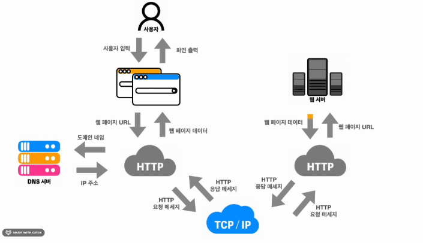

# 📖Weekly Paper - Week 4

# 🔍Q1.
- 🇶1. var, let, const 를 중복 선언 허용, 스코프, 호이스팅 관점에서 서로 비교해 주세요.
> 자바스크립트는 var라는 키워드로 변수 선언하던 때가 있었으나 몇 가지 문제로 인해 거의 사용되지 않게 되었습니다. 어떤 문제들인지 같이 확인해볼까요?!

### Var의 문제

1. 중복 선언 가능

```jsx
var myVariable = 'codeit';
console.log(myVariable);
var myVariable = 'Codeit!';
console.log(myVariable); 
// codeit / Codeit!
```

- let, const와 다르게 중복 선언 가능
- 같은 이름으로 변수 한 번 더 선언 시 에러가 아닌 기존의 변수 덮어씀
-> 중복 선언이 가능해지면 길고 복잡한 코드 작성 시 실수 가능성이 향상되고 상황에 따라 치명적 오류 발생 가능
<br><br>

2. 함수 스코프

```jsx
{ // x에 접근 O
  var x = 3;
}
function myFunction() { // func만 접근 X
  var y = 4;
}
```

- { }안에는 밖에서 접근 불가한 let, const와 달리
- `if, for, while, switch` 등 다양한 상황에서 선언한 변수가 자칫, 전역변수의 역할 O
<br><br>

3. 호이스팅(Hoisting)

```jsx
console.log(myVariable);
var myVariable;
// undefined
```

- `let, const`는 선언 이전 사용 X
- `var`는 호이스팅으로 변수 선언이 끌어올려지며, 함수도 호이스팅이 적용되어 선언 전 호출해도 동작 → 코드 흐름에 **부정적** 영향

## 결론
| 키워드 | 재할당 가능 여부 | 재선언 가능 여부 | 블록 스코프 | 호이스팅 | 특징 |
| --- | --- | --- | --- | --- | --- |
| `var` | 가능 | 가능 | 없음 | 선언과 초기화가 함께 호이스팅되지만, 초기화는 `undefined`로 됨 | 함수 스코프, 예상치 못한 버그 발생 가능 |
| `let` | 가능 | 불가능 | 있음 | 선언은 호이스팅되지만, 초기화는 호이스팅되지 않음 (TDZ 발생) | 블록 스코프, `var`보다 안전함 |
| `const` | 불가능 | 불가능 | 있음 | 선언은 호이스팅되지만, 초기화는 호이스팅되지 않음 (TDZ 발생) | 블록 스코프, 상수(변경 불가) |

# 🔍Q2.
- 🇶2. 브라우저가 어떻게 동작하는지 설명해 주세요.



### 웹 브라우저(Web Browser)
- 웹 서버에서 HTTP를 통해 양방향으로 통신을 하며
- HTML 문서 및 그림, 멀티미디어(ex. 동영상) 등의 컨텐츠를 열람할 수 있게 해주는
- GUI 기반의 소프트웨어 프로그램
<hr>

### 1. URL 입력 및 요청(Request) 과정
사용자가 주소창에 URL 입력 후 엔터를 누르면, 브라우저는 해당 URL을 해석함.
URL에 해당하는 DNS 조회를 통해 도메인(예: google.com)을 IP 주소로 변환.
해당 IP 주소로 HTTP 요청(GET, POST 등)을 보냄.
요청한 서버가 요청을 처리하고 응답(Response)을 보냄.

### 2. 서버 응답 및 HTML 파싱 (Parsing)
서버가 HTML, CSS, JavaScript 등의 데이터를 클라이언트(브라우저)로 전송.
브라우저는 받은 HTML을 **파싱(Parser)**하여 DOM 트리(Document Object Model)를 생성.

CSS 파일이 로드되면 **CSSOM (CSS Object Model)**을 생성.
JavaScript 파일을 로드 및 실행하며 DOM을 조작할 수 있음.
DOM과 CSSOM을 합쳐 **렌더 트리(Render Tree)**를 생성.

### 3. 렌더링 및 화면 출력 (Rendering & Painting)
레이아웃(Layout) 계산: 요소의 위치와 크기를 계산.
페인팅(Painting): 계산된 요소들을 화면에 그려줌.
컴포지팅(Compositing): 여러 레이어를 최적화하여 최종 화면을 출력.

### 4. JavaScript 실행 및 이벤트 처리
브라우저의 JavaScript 엔진(예: V8, SpiderMonkey, Chakra)이 스크립트를 실행.
JavaScript는 싱글 스레드로 동작하며, 이벤트 루프(Event Loop)를 통해 비동기 작업 처리.

클릭, 입력 등의 사용자 이벤트 발생 시 브라우저가 처리하고 DOM을 업데이트.

### 5. 리플로우(Reflow)와 리페인트(Repaint)
리플로우 (Reflow): DOM의 레이아웃이 변경되면 다시 계산하는 과정 (비용이 큼).
리페인트 (Repaint): 스타일만 변경될 경우 다시 그리는 과정 (비용이 상대적으로 적음).

### 📌 정리
브라우저는 URL 입력 → 요청 및 응답 → HTML/CSS 파싱 → 렌더링 → 화면 출력 → JavaScript 실행 및 이벤트 처리의 과정을 거치며 웹페이지를 표시함.
최적화된 성능을 위해 브라우저는 **렌더링 엔진(WebKit, Blink 등)과 JavaScript 엔진(V8, SpiderMonkey 등)**을 사용함.